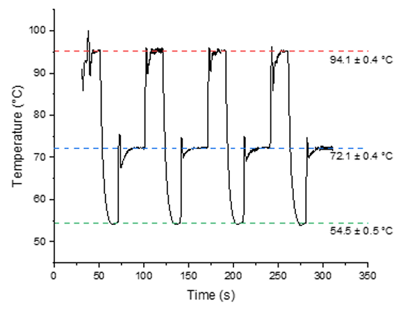

# DNA Duplication via SAW-assisted PCR

**Institution:** Institut Jean Lamour / Polytech Nancy
**Context:** Research and Development (Third-year Engineering Project)

## Project Overview
This project involved the design and automation of a microfluidic characterization bench for Polymerase Chain Reaction (PCR) using Surface Acoustic Waves (SAW). The goal was to develop a precise thermal regulation system to automate DNA amplification cycles on a micro-scale droplet (0.5 microliters).

This work contributed to the doctoral thesis research of Clémence Biscara at the Institut Jean Lamour.

For more information about the workings of this project, check out the provided images in the **assets** folder.

## Key Technical Contributions

### 1. Automation & Control System
* **PID Regulation:** Designed and tuned a digital PID controller with Feed-Forward compensation to manage rapid temperature transitions.
* **Thermal Cycling:** Automated the three critical PCR stages:
    * Denaturation (94 C)
    * Hybridization (60 C)
    * Elongation (72 C)
* **State Machine:** Implemented a robust state machine in LabVIEW to handle the logic flow between heating, cooling, and dwelling phases.

 

  

 

### 2. Hardware Interfacing & Integration
Developed drivers and communication protocols to interface multiple laboratory instruments into a centralized control loop:
* **Thermal Imaging:** Real-time temperature acquisition using an **Optris** thermal camera (process feedback).
* **Signal Generation:** Remote control of a bass frequency generator via USB/VISA to drive the piezoelectric SAW device.
* **System Identification:** Modeled the thermal response of the SAW device to optimize control stability.

## Technical Stack
* **Software:** LabVIEW (G-Code), Python (Feasibility analysis)
* **Communication Protocols:** VISA, Serial (USB/COM), TCP/IP
* **Hardware:** Piezoelectric SAW sensors, RF Amplifiers, Infrared Thermography

## Collaborators
* Lucas Audin
* Timothé Tulasne

## Intellectual Property & Confidentiality
*Note: The source code, specific resonance frequencies, and exact PID tuning parameters are confidential due to the ongoing nature of the doctoral research associated with this project. This repository serves as a technical overview of the engineering challenges solved during development.*
